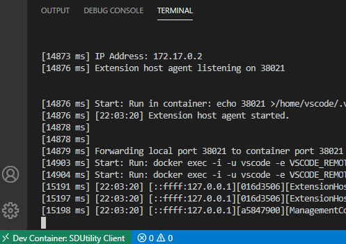
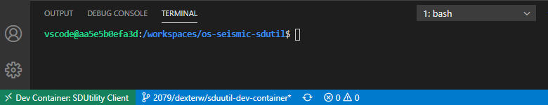
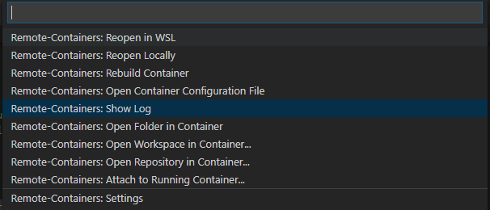
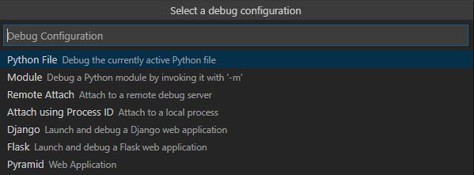
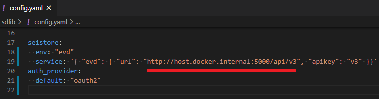
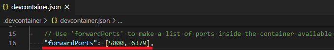

## Background
The goal of this .devcontainer is to create a VS Code container with all the tools, libraries, and frameworks so that developers on the SDMS project team can quickly begin developing without having spending cycles setting up the correct development environment. Devcontainers are recommended for macOS, Linux and Windows WSL2 operating system scenarios. Devcontainers are not meant as a replacement for the Dockerfile needed in CI/CD test automation. Devcontainers are meant to improve the local deveopment experience.

This README assumes you have followed the installation steps outlined [here](https://code.visualstudio.com/docs/remote/containers#_installation).

## Visual Studio Code Remote - Containers
Using the [Visual Studio Code Remote - Containers](https://code.visualstudio.com/docs/remote/containers) feature allows for creation of a Docker container that is configured with the correct development environment. We will use folder-based devcontainers for this repo.

### Folder-based Devcontainers
This current Devcontainer is scoped to a repo folder. Currently the Docker image installs the following tools and libraries. See Dockerfile for more details.

#### Tools and Libraries
* python 3+
* virtualenv
* pip
* flake8
* autopep8
* black
* yapf
* mypy
* pydocstyle
* pycodestyle
* bandit


#### Requirements
Dockerfile currently looks to the `requirements.txt` for the remaining python tools and libraries.

#### Extensions
The image also has the following VS Code extension installed. See devcontainer.json for more details.
* ms-python.python

## Gettting started 
Clone this repo, you will notice that there is a .devcontainer directory. Inside this directory is the Dockerfile and devcontainer.json which tell VS Code how to manage the container. 

Start VS Code, and in a new window, click on the quick actions stations on the lower left corner. Select 'Remote-Containers: Open Folder' in Container from the command list that appears. If not there, search for it or ensure the `ms-vscode-remote.remote-containers` extension is installe. The below screenshot has an example.


Select the repo that you just cloned (the one with .devcontainer directory at the root), this will cause VS Code to build the container and open the directory as you can see below. 



You can begin debugging and running the appliction going forward. 



### Debugging Inside A DevContainer

Development Containers grant you the ability to visually navigate, modify, debug and execute open project files within a docker container that is running. Changes to your project files do not require you to manually rebuild the container. The only files which demand a manual rebuild after a change has been made are the `Dockerfile` and `devcontainer.json` file from within the `.devcontainer` directory. To view the container commands that are executing at any time, click on the quick actions stations in the lower left corner of vs code and select 'Remote-Containers: Show Log'.



You will be running the SDUtil application with login credentials or an Oauth2 token. If login credentials or Oauth2 token is not available, request either from your system admin.

#### DevContainer Sessions and Package Management

Current implementation of devcontainers bakes requirements.txt packages into the image. However, devcontainers have the concept **user session** in which devs interacting with source code from within the container can exit the container and return to the running container without losing their session state and without rebuilding the container. Therefore, new changes made to the requirements.txt outside the user session are by default not detected upon resuming the session. To activate detection of [requirements.txt](../requirements.txt) changes and package syncronization, take advantage of devcontainer's [**poststartcommand**](https://code.visualstudio.com/docs/remote/devcontainerjson-reference) feature with the following command as a value.

> Note: Orphaned packages leftover as a result of uninstalling python packages are not removed between devcontainer **user session**. A clean package environment requires a docker rebuild of the devcontainer. Docker rebuilds are recommended when experiencing issues with python packages during a devcontainer **user session**.

```json
// Manages devcontainer lifecycle
{
    "name": "SDUtility Client",
    ...
    "postStartCommand": "./../session/post-create/sync_deps.py",
    ...
}
```

#### Running with Oauth2 token

1. Configure `./sdlib/config.yaml`

    If SDMS application is running on host machine's `localhost`, `localhost` is replaced with `host.docker.internal`. (On Windows, whitelist vscode, docker and node program if SDMS refuses service)

    ```yaml
    seistore:
      env: "evd"
      service: '{ "evd": { "url": "http://host.docker.internal:5000/api/v3", "appkey": "v3" }}'
    auth_provider:
      default: "oauth2"
    ```

2. Configure `./sdlib/config_oauth2.yaml`

    Choosing provider is needed for oauth2 provider factory pattern.

    ```yaml
    oauth2:
        provider: 'google'
        authorize_url: 'https://accounts.google.com/o/oauth2/auth'
        authorize_params: 'None'
        access_token_url: 'https://oauth2.googleapis.com/token'
        access_token_params: 'None'
        refresh_token_url: 'https://oauth2.googleapis.com/token'
        refresh_token_params: 'None'
        open_id_url: 'https://accounts.google.com/o/oauth2/auth'
        scope: 'environment: evd'
    ```

3. Configure `.vscode/launch.json`

    Open any python file and then execute the `Ctrl+Shift+D` shortcut for creating a `launch.json` file. Choose the module option and name the module 'sdutil'.

    
    
     This file is used for your debugger settings. Refer to Usage section of the official [SDUtil README](../README.md) for more information on SDUtil commands to use for `launch.json` options. All commands will require `--idtoken` to be satisfied.

    ```json
        "configurations": [
            {
                "name": "Python: Module",
                "type": "python",
                "request": "launch",
                "module": "sdutil",
                "args": ["ls", "sd://k8s", "--idtoken=<Oauth2Token>"]
            }
        ]
    ```

4. Press F5 to start a debugging session

#### Running with all login credentials

NOTE: SDUtil commands will no longer require `--idtoken` flag when all login credentials are provided.

TBD 

### DevContainer to DevContainer 

`Os-seismic-sdutil` as a client application relies on the [`Os-seismic-store-svc`](https://dev.azure.com/slb-des-ext-collaboration/open-data-ecosystem/_git/os-seismic-store-svc) application to manage the dataset lifecycle. Datasets are explained in the main [readme](../README.md) of this application. It may very well be the case that development efforts require both applications to be running locally. When then is the case, because both applications come with instructions for granting developers with the devcontainer experience, devcontainer to devcontainer is possible. If the operatoring system requirements are being respected (macOS, Linux and Windows WSL2), following the instructions for both applications should lead to a scenario which allows devcontainer to devcontainer communication. 

Highlighted below is a crucial step in the proper configuration of the network layer that makes cross-communication possible for each application.

|`Os-seismic-sdutil` (override localhost) |`Os-seismic-store-svc` (activate port forwarding) |
|---|---|
|  |  |

